# AbouSchedule

[](https://github.com/yourusername/AbouSchedule)
[](https://github.com/yourusername/AbouSchedule/releases)
[](https://github.com/yourusername/AbouSchedule/blob/main/LICENSE)
[](https://expo.dev/)
[](https://railway.app/)

A comprehensive task management application built with React Native/Expo and a Node.js backend, featuring role-based access control, media management, and real-time notifications.

## 📋 Table of Contents

- [Features](#features)
- [Quick Start](#-quick-start)
- [Tech Stack](#-tech-stack)
- [Screenshots](#screenshots)
- [API Endpoints](#api-endpoints)
- [Configuration](#configuration)
- [Security Features](#-security-features)
- [Notification System](#-notification-system)
- [Database Schema](#-database-schema)

- [Troubleshooting](#-troubleshooting)
- [Contributing](#-contributing)

## 🚀 Quick Start

### Prerequisites
- Node.js (v18 or higher)
- pnpm (recommended) or npm
- Expo CLI (`npm install -g @expo/cli`)
- Android Studio (for Android development)
- Xcode (for iOS development, macOS only)

### Installation

1. **Clone the repository**
   ```bash
   git clone https://github.com/yourusername/AbouSchedule.git
   cd AbouSchedule
   ```

2. **Install frontend dependencies**
   ```bash
   cd frontend
   pnpm install
   ```

3. **Start the development server**
   ```bash
   pnpm start
   ```

4. **Run on device**
   - Install Expo Go on your mobile device
   - Scan the QR code from the terminal
   - Or press 'a' for Android emulator, 'i' for iOS simulator

### Quick Demo
- **Live Demo**: [Coming Soon]
- **Test Credentials**: 
  - Admin: `admin@example.com` / `password123`
  - User: `user@example.com` / `password123`

## Features
- **Task Management**: Create, edit, and organize tasks with priorities and status tracking
- **Role-Based Access**: Admin and Employee roles with different permissions
- **Media Management**: Upload and manage images and documents for tasks
- **Real-Time Notifications**: Firebase Cloud Messaging (FCM) push notifications for immediate tasks
- **Recurring Tasks**: Support for daily, weekly, monthly, and yearly recurring tasks
- **Task Status Tracking**: PENDING, ACTIVE, DONE status management

### Admin Features
- **User Management**: View, edit, and manage all users
- **Cross-User Task Management**: Create and manage tasks for any user
- **Media Overview**: View all media across all users
- **Role Toggle**: Change user roles with password verification

### User Features
- **Personal Task Dashboard**: View and manage your own tasks
- **Media Gallery**: Browse your uploaded images and documents
- **Task Filtering**: Sort by priority, status, and creation date
- **Bulk Actions**: Select and share multiple media items

## 🛠 Tech Stack

### Frontend
- **React Native** with Expo
- **TypeScript** for type safety
- **Expo Router** for navigation
- **React Native Image Viewing** for media display
- **Expo Notifications** for push notifications
- **Expo File System** for local file management
- **Firebase Cloud Messaging** for real-time push notifications

### Backend
- **Node.js** with Fastify
- **Prisma** ORM with PostgreSQL
- **JWT** authentication
- **AWS S3** for file storage
- **Firebase Admin SDK** for server-side notification management
- **Railway** for deployment

### Database
- **PostgreSQL** with Prisma migrations
- **Task recurrence** support
- **Media metadata** tracking
- **User role** management

## Screenshots

### App Icon


The AbouSchedule app icon features a friendly, minimalist design with a person holding a calendar. The icon represents task management and scheduling with a clean, modern aesthetic that reflects the app's user-friendly approach to task organization.

### Navigation Menu
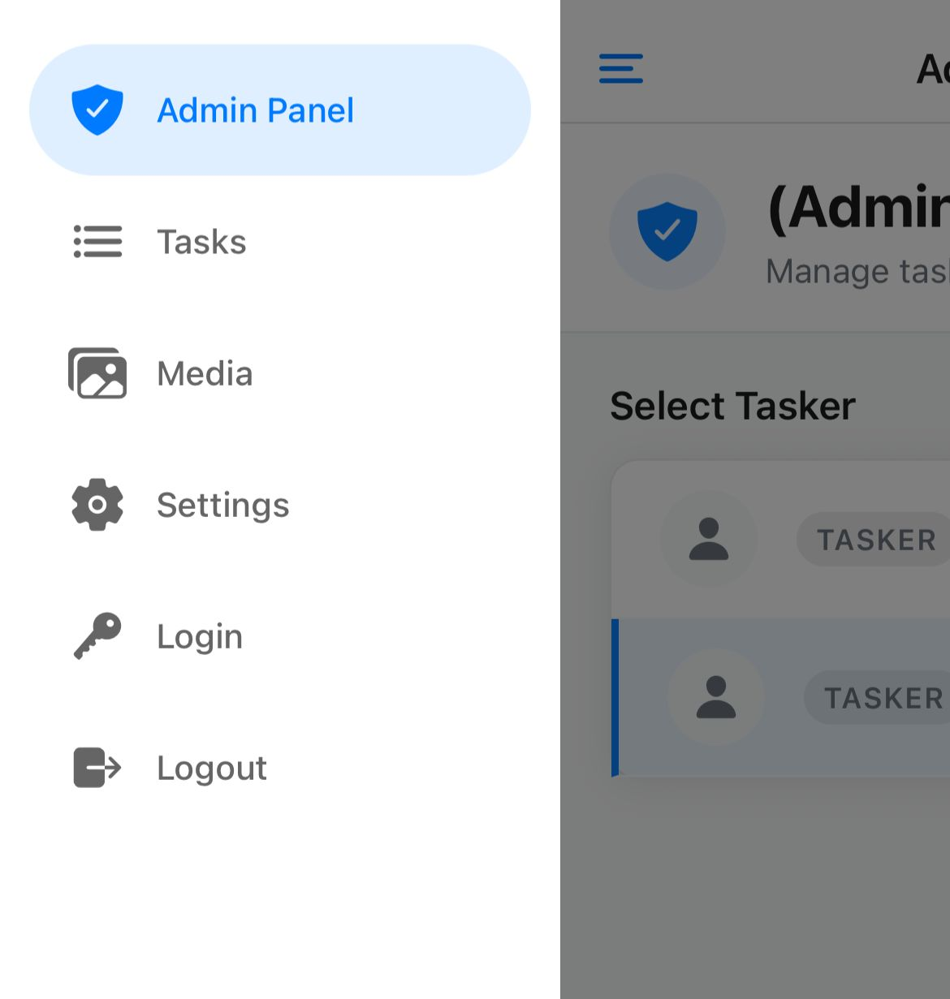

The navigation menu provides role-based access to different sections of the application. The Admin Panel option is only visible to users who are logged in with admin privileges, ensuring secure access control.

#### Key Features:
- **Role-Based Visibility**: Admin Panel appears only for admin users with blue shield icon
- **Active State Indication**: Current section highlighted with blue background and checkmark
- **Navigation Options**: Tasks, Media, Settings, Login, and Logout with intuitive icons
- **User Context**: Shows current user role and admin status
- **Clean Design**: Modern white background with clear visual hierarchy

### Authentication Screens

#### Login Interface
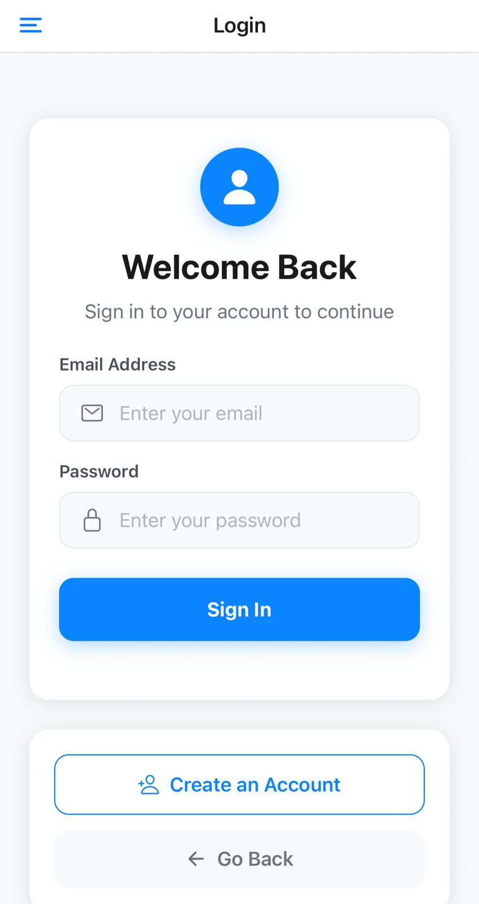

The login interface provides a clean and secure authentication experience with a modern card-based design. This streamlined interface focuses on essential login functionality while maintaining visual appeal.

#### Key Features:
- **User Icon**: Prominent blue circular icon with person silhouette for visual identity
- **Welcome Message**: "Welcome Back" greeting with clear instructional text
- **Input Fields**: Email and password fields with intuitive icons (envelope and padlock)
- **Form Validation**: Real-time validation with placeholder text guidance
- **Sign In Button**: Prominent blue button for primary action
- **Account Creation**: Secondary button for new user registration
- **Navigation**: Back button for easy navigation

#### Registration Interface
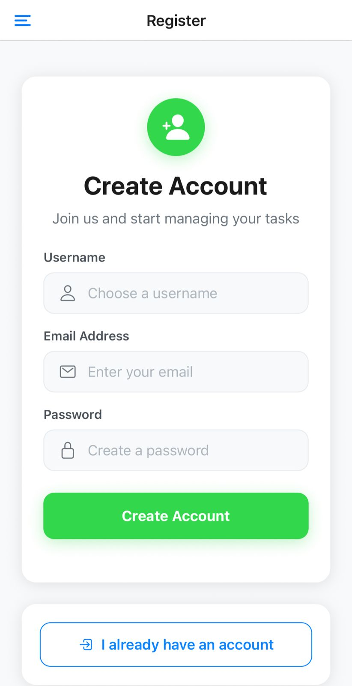

The registration interface offers a comprehensive account creation process with a user-friendly design that guides new users through the onboarding experience.

#### Key Features:
- **Account Icon**: Green circular icon with person silhouette and plus sign indicating account creation
- **Clear Messaging**: "Create Account" title with descriptive subtitle
- **Input Fields**: Username, email, and password fields with appropriate icons
- **Form Guidance**: Placeholder text and visual indicators for each field
- **Create Account Button**: Prominent green button for account creation
- **Existing User Option**: Secondary button for users who already have accounts
- **Visual Hierarchy**: Clean layout with proper spacing and typography

Both authentication screens feature:
- **Responsive Design**: Adapts to different screen sizes
- **Accessibility**: Clear labels and intuitive navigation
- **Security Focus**: Proper input validation and secure authentication flow
- **Brand Consistency**: Maintains the app's visual identity and design language

### Admin Panel
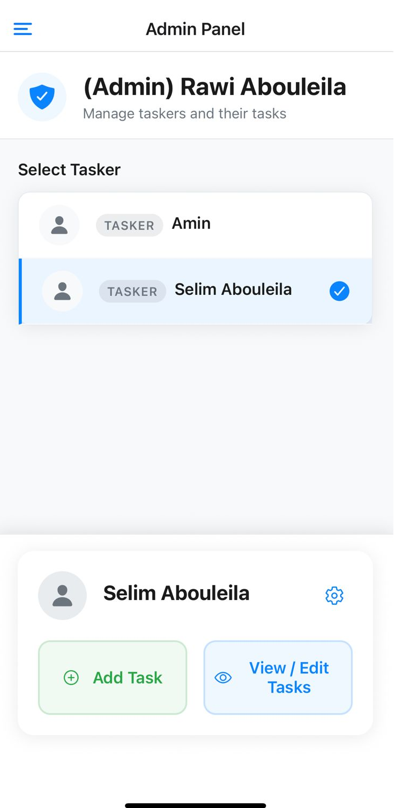

The Admin Panel is the central hub for administrators to manage taskers and their tasks. This interface provides comprehensive user management capabilities with an intuitive design.

#### Key Features:

**Header Section:**
- **Admin Identification**: Displays "(Admin) [Username]" with a blue shield icon indicating admin privileges
- **Role Description**: "Manage taskers and their tasks" subtitle explains the panel's purpose

**Tasker Selection:**
- **User List**: Shows all available taskers with their role badges ("TASKER")
- **Visual Selection**: Selected tasker is highlighted with a blue left border and checkmark icon
- **User Icons**: Each tasker has a person icon for easy identification

**Task Management Actions:**
- **Add Task Button**: Green button with plus icon to create new tasks for the selected tasker
- **View/Edit Tasks Button**: Blue button with eye icon to manage existing tasks
- **Settings Gear**: Blue gear icon for advanced user management options

**Design Elements:**
- **Card-based Layout**: Clean white cards with rounded corners for organized content
- **Color-coded Actions**: Green for creation, blue for viewing/editing
- **Responsive Design**: Adapts to different screen sizes with proper spacing

This panel serves as the primary interface for administrators to oversee task distribution and user management across the entire system.

#### Admin Settings Workflow

**Password Verification Modal**
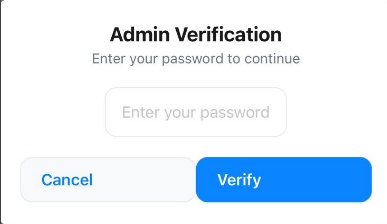

When an admin clicks the settings gear icon for a user, the system first requires password verification for security. This modal prompts the administrator to "Enter your password to continue" with a secure text input field, ensuring that only authorized administrators can perform sensitive user management actions.

**User Management Actions**
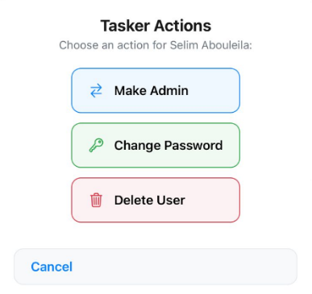

After successful password verification, administrators can perform various user management actions for the selected user (e.g., "Selim Abouleila"):

- **Make Admin**: Light blue button with double-arrow icon to toggle user role between tasker and admin
- **Change Password**: Light green button with key icon to reset user password
- **Delete User**: Light red/pink button with trash can icon for destructive account removal

This two-step security process ensures that sensitive administrative actions are properly authenticated and logged, with clear visual indicators and color-coded actions for different operation types.

### Admin User Task List
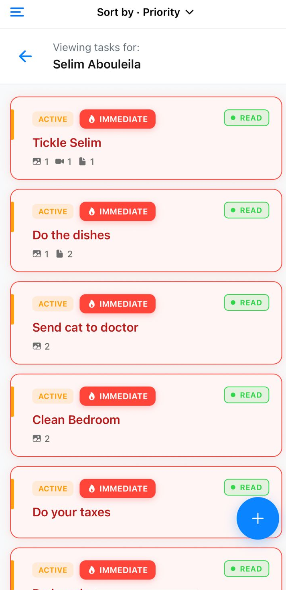

The Admin User Task List provides a comprehensive overview of tasks assigned to a specific user. This screen allows administrators to view, sort, and manage individual tasks efficiently.

#### Key Features:
- **User-Specific View**: Clearly displays tasks for a selected user (e.g., "Selim Abouleila")
- **Sorting Options**: Tasks can be sorted by various criteria, with "Priority" as the default, accessible via a dropdown menu
- **Task Card Details**: Each task card provides a quick summary including:
  - **Status**: Indicated by a yellow "ACTIVE" label (matching the 'NONE' priority color)
  - **Priority**: Highlighted by a red "IMMEDIATE" label with a flame icon
  - **Read Status**: A green "READ" label
  - **Task Title**: A clear description of the task
  - **Media Attachments**: Icons and counts for associated images, videos, and documents, confirming support for multiple files of each type
- **Add New Task**: A floating blue "+" button allows for quick creation of new tasks for the selected user

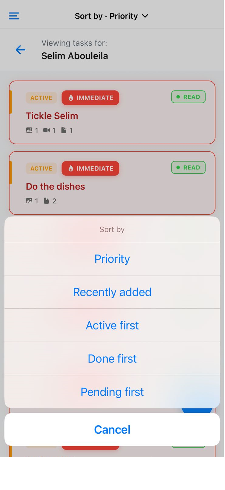

The sorting interface provides multiple options for organizing tasks efficiently:
- **Priority**: Currently selected sorting method (highlighted in blue)
- **Recently added**: Sort by creation date
- **Active first**: Prioritize active tasks
- **Done first**: Show completed tasks first
- **Pending first**: Display pending tasks at the top
- **Cancel**: Dismiss the sorting menu

### Admin Task Creation
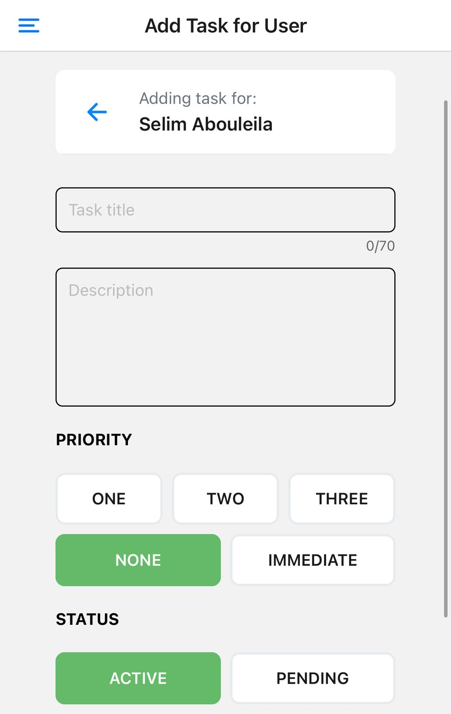

The admin task creation interface allows administrators to create tasks for any selected tasker. This comprehensive form includes all task management features with an intuitive design.

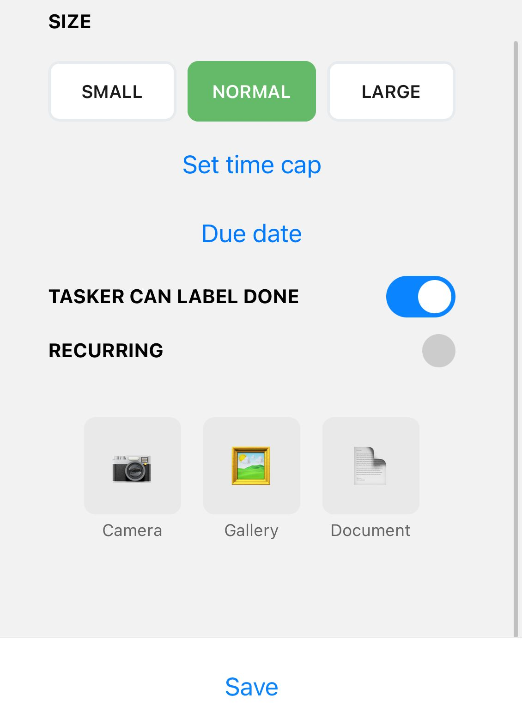

The task creation process includes priority selection, status management, and media upload capabilities, providing administrators with full control over task assignment and configuration.

#### Key Features:
- **User Selection**: Clear indication of which tasker the task is being created for with back navigation
- **Task Details**: Title input with character counter (0/70) and description text area
- **Priority System**: Color-coded priority buttons (ONE, TWO, THREE, NONE, IMMEDIATE) with gradient from orange to light green
- **Status Management**: ACTIVE/PENDING status selection with matching color scheme
- **Size Configuration**: SMALL, NORMAL, LARGE size options for task scope
- **Time Management**: Set time caps and due dates for task completion tracking
- **Tasker Permissions**: Toggle for "TASKER CAN LABEL DONE" to control completion rights
- **Recurring Tasks**: Enable recurring task functionality with advanced scheduling options
- **Media Upload**: Support for multiple images, videos, and documents via Camera, Gallery, and Document picker
- **Save Functionality**: Pinned save button for easy task creation

### Admin Task View
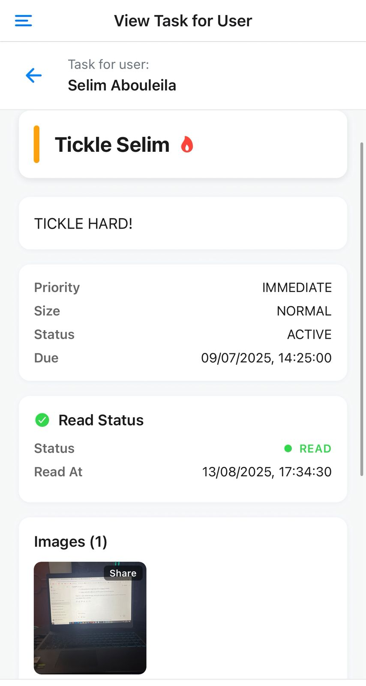

The Admin Task View provides a comprehensive detailed view of a specific task assigned to a user. This interface displays all task information, media attachments, and status tracking in an organized card-based layout.

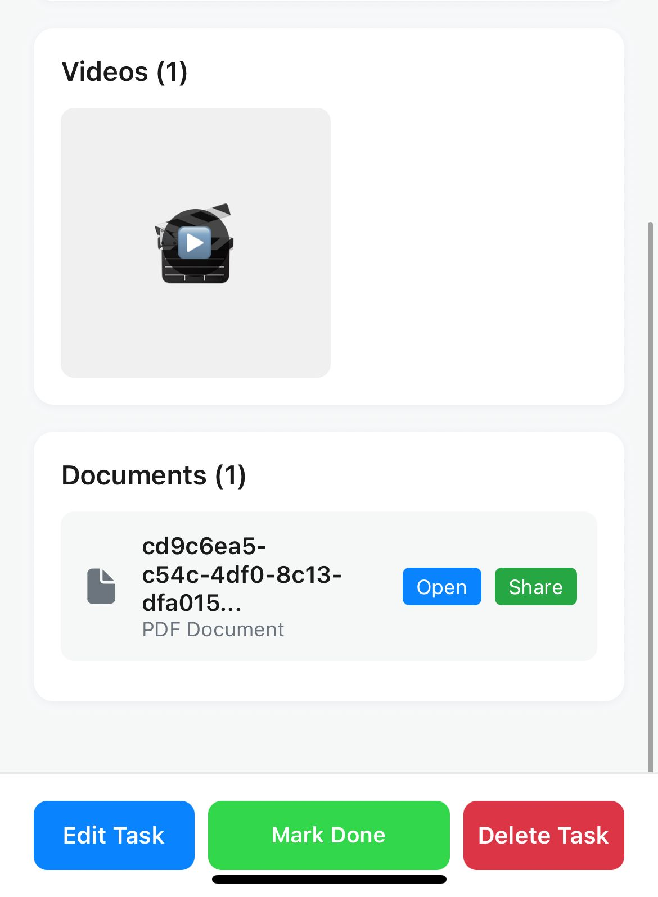

The task view includes media management and action buttons for complete task administration.

#### Key Features:
- **Task Information**: Title with flame emoji, description, and structured details (Priority, Size, Status, Due Date)
- **Read Status Tracking**: Green checkmark with timestamp showing when the task was read
- **Media Attachments**: Organized sections for Images, Videos, and Documents with preview thumbnails
- **Media Actions**: Share buttons for images, Open/Share options for documents and videos
- **Task Management**: Pinned action buttons (Edit Task, Mark Done, Delete Task) for quick administration
- **User Context**: Clear indication of which user the task is assigned to

### Task Recurrence System
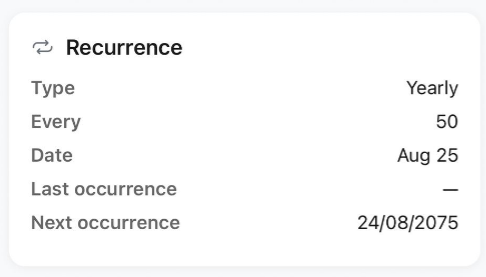

The recurrence system provides advanced scheduling capabilities for tasks that need to repeat automatically. This feature appears in any task view where recurrence is enabled, displaying comprehensive scheduling information.

#### Key Features:
- **Recurrence Type**: Shows the frequency (Yearly, Monthly, Weekly, Daily)
- **Interval**: Displays how often the task repeats (e.g., "Every 50" years)
- **Date Configuration**: Specific date for the recurrence pattern (e.g., "Aug 25")
- **Occurrence Tracking**: Last occurrence and next occurrence timestamps
- **Visual Indicators**: Refresh/loop icon indicating recurring nature

#### Backend Recurrence Calculation:
The system implements a sophisticated recurrence engine with three core components:

**1. `nextDate()` Function (`lib/recur.ts`):**
- **Date Normalization**: Normalizes reference points using `date-fns` utilities (`startOfDay`, `startOfWeek`, `startOfMonth`, `startOfYear`)
- **UTC Time Clamping**: Enforces 21:00 UTC execution time using `atNineUtc()` helper to prevent timezone drift
- **Pattern-Specific Logic**:
  - **DAILY**: Simple `addDays()` with step interval
  - **WEEKLY**: `addWeeks()` + `setDay()` with `weekStartsOn: 1` (Monday-based)
  - **MONTHLY**: `addMonths()` + `setDate()` with day-of-month validation
  - **YEARLY**: `addYears()` + `set()` with month/day clamping for edge cases (e.g., Feb 29 → Feb 28)
- **Future Guarantee**: Ensures calculated dates are always in the future relative to base date

**2. Recurrence Roller (`lib/roll-recurrence.ts`):**
- **Cron Scheduling**: Executes daily at midnight Cairo time (`0 0 * * *` with `timezone: 'Africa/Cairo'`)
- **Database Query**: Fetches tasks where `nextOccurrence <= now` AND `recurrence != NONE`
- **Catch-up Logic**: Handles server downtime by iterating `nextDate()` until future date is reached
- **End Date Validation**: Respects `recurrenceEnd` constraints and marks tasks as `DONE` when expired
- **Atomic Updates**: Single `prisma.task.update()` call updates `lastOccurrence`, `nextOccurrence`, and `status`

**3. Server Integration (`server.ts`):**
- **Initialization**: `startRecurrenceRoller()` called at server startup (line 2094)
- **Background Processing**: Runs independently of HTTP requests
- **Error Handling**: Graceful degradation with console logging for monitoring

**Technical Constraints:**
- **Time Caps**: 21:00 UTC execution prevents timezone-related scheduling issues
- **Database Consistency**: Uses Prisma transactions for atomic state updates
- **Memory Efficiency**: Processes tasks in batches to prevent memory leaks
- **Timezone Handling**: Cairo timezone ensures consistent local time execution

This architecture ensures reliable, timezone-aware recurring task execution with automatic catch-up for missed periods and proper lifecycle management.

### Task Completion Workflow
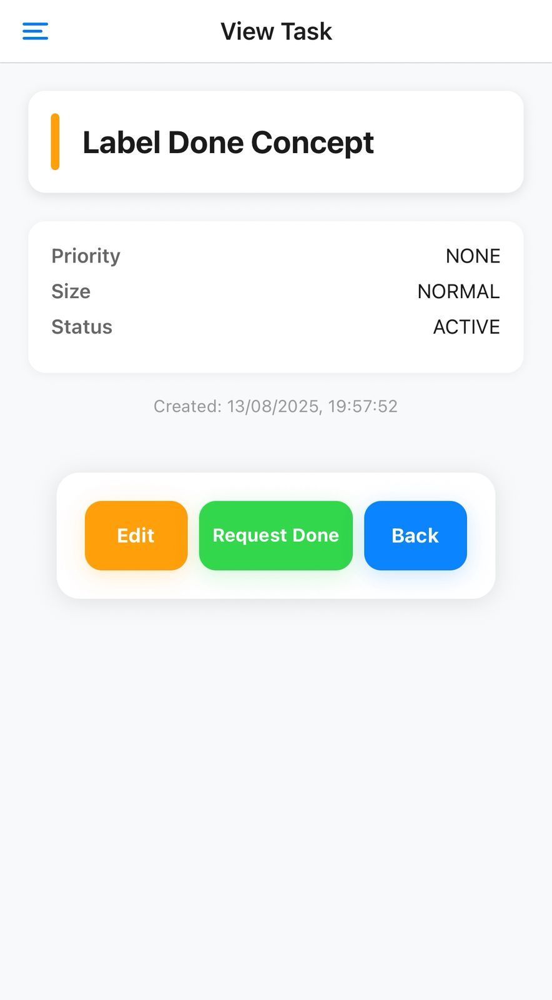

The task completion system implements a flexible approval workflow that adapts based on task configuration. This feature ensures proper oversight while maintaining operational efficiency.

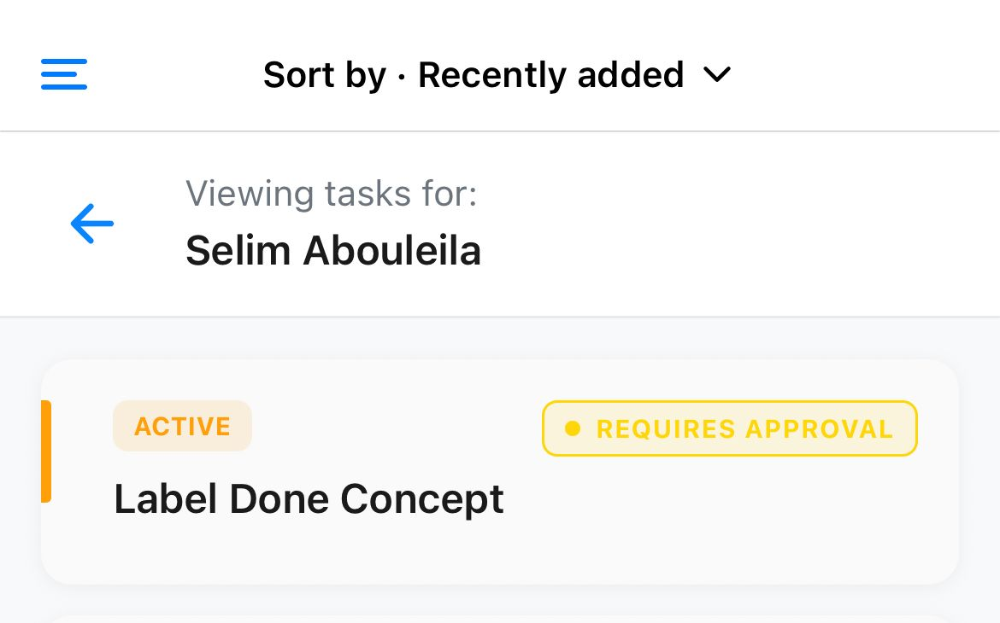

The completion workflow provides two distinct modes based on the `can_label_done` setting:

#### Key Features:
- **Flexible Approval System**: Tasks can be configured for either direct completion or admin approval
- **User Experience**: Clear visual indicators show completion status and required actions
- **Admin Oversight**: Administrators can review and approve completion requests
- **Status Tracking**: Real-time updates on task completion state

#### Workflow Modes:

**Direct Completion (`can_label_done: true`):**
- Users can mark tasks as "Done" immediately
- No admin approval required
- Instant status update to "DONE"
- Suitable for routine or low-priority tasks

**Approval Required (`can_label_done: false`):**
- Users must submit a "Request Done" for approval
- Task status changes to "PENDING APPROVAL"
- Admin receives notification and can approve/reject
- Ensures quality control for critical tasks
- Admin can review task completion before final approval

This dual-mode system provides administrators with granular control over task completion while maintaining user autonomy for appropriate tasks.

### Media Management System
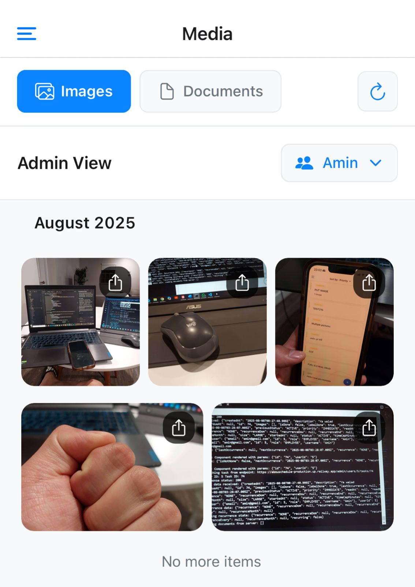

The Media Management system provides comprehensive file organization and viewing capabilities for both administrators and users. This interface supports multiple file types with advanced filtering and organization features.

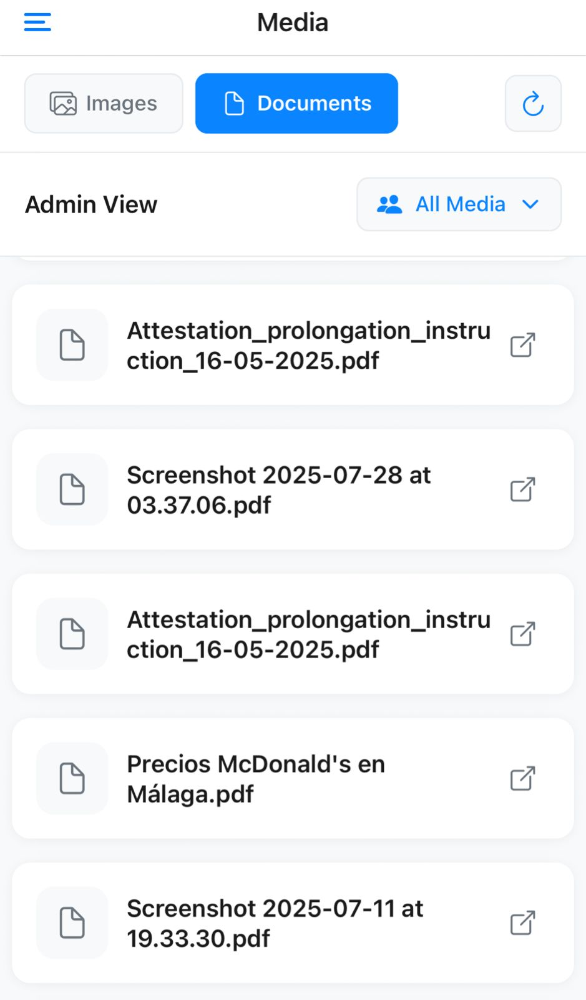

The media interface offers dual-mode viewing with specialized layouts for different file types:

#### Key Features:
- **Multi-Format Support**: Dedicated views for Images and Documents with optimized layouts
- **Admin Overview**: Administrators can view all media across all users with user filtering
- **Chronological Organization**: Media files grouped by date (e.g., "August 2025")
- **Thumbnail Previews**: Image thumbnails with upload indicators for easy identification
- **Document Management**: PDF files with open/share functionality
- **User Filtering**: Admin can filter media by specific users or view all media
- **Refresh Capability**: Real-time content updates with refresh functionality

#### Admin Capabilities:
- **Cross-User Access**: View media from all users in the system
- **User Selection**: Filter media by specific users via dropdown
- **Comprehensive Overview**: Monitor all uploaded content across the organization
- **File Management**: Access, view, and manage all media types

#### User Experience:
- **Personal Gallery**: Users can view their own uploaded media
- **File Actions**: Open, share, and manage individual files
- **Visual Organization**: Clean grid layout with proper spacing and visual hierarchy
- **Quick Access**: Intuitive navigation between image and document views

This system ensures efficient media management with role-appropriate access levels and comprehensive file organization capabilities.

### Settings & Configuration
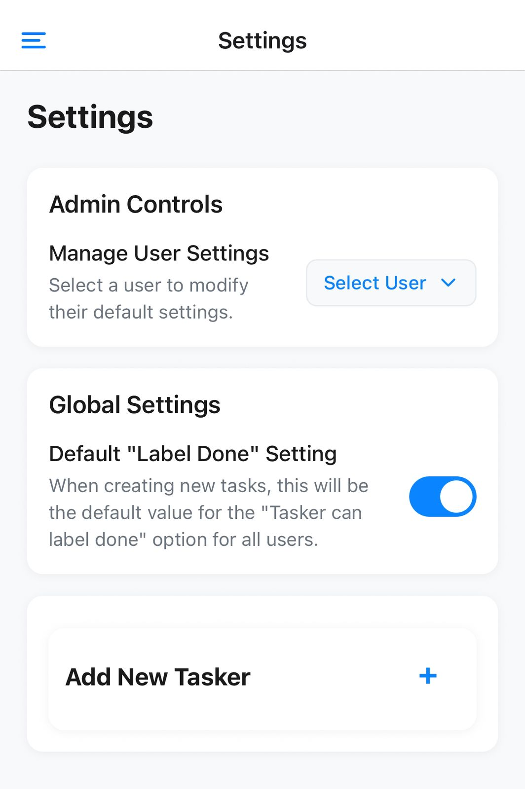

The Settings interface provides comprehensive system configuration capabilities for administrators, offering granular control over user management and global application settings.

#### Key Features:
- **Admin Controls**: User-specific settings management with dropdown selection
- **Global Settings**: System-wide configuration for default task completion behavior
- **User Management**: Add new taskers to the system with streamlined onboarding
- **Card-Based Layout**: Clean, organized interface with clear visual separation

#### Configuration Sections:

**Admin Controls:**
- **User Selection**: Dropdown menu to select specific users for settings modification
- **Individual Settings**: Manage default settings for selected users
- **User Management**: Modify user-specific configurations and preferences

**Global Settings:**
- **Default "Label Done" Setting**: Toggle for system-wide task completion behavior
- **Task Creation Defaults**: Controls whether new tasks require admin approval by default
- **Organization-Wide Impact**: Changes affect all future task creation across the system

**Add New Tasker:**
- **Quick User Addition**: Streamlined process for adding new users to the system
- **Role Assignment**: Automatic assignment of tasker role for new users
- **System Integration**: Seamless onboarding with immediate access to task management

This centralized configuration system ensures consistent behavior across the application while providing administrators with the flexibility to customize settings for individual users and the entire organization.

## API Endpoints

### Authentication
- `POST /auth/login` - User login
- `POST /auth/register` - User registration

### Tasks
- `GET /tasks` - Get user's tasks
- `POST /tasks` - Create new task
- `PATCH /tasks/:id` - Update task
- `DELETE /tasks/:id` - Delete task

### Admin
- `GET /admin/users` - Get all users
- `POST /admin/users/:id/toggle-role` - Toggle user role
- `GET /admin/all-tasks` - Get all tasks
- `GET /admin/users/:userId/tasks` - Get user's tasks

### Media
- `GET /tasks/media` - Get media files
- `POST /tasks/media` - Upload media

## Configuration

### Task Priorities
- `IMMEDIATE` - Highest priority with notifications
- `RECURRENT` - Recurring tasks
- `ONE`, `TWO`, `THREE` - Standard priorities
- `NONE` - No priority

### Task Status
- `PENDING` - Task is waiting
- `ACTIVE` - Task is in progress
- `DONE` - Task is completed

### Recurrence Types
- `NONE` - One-time task
- `DAILY` - Repeats daily
- `WEEKLY` - Repeats weekly
- `MONTHLY` - Repeats monthly
- `YEARLY` - Repeats yearly

## 🔐 Security Features

- **JWT Authentication** with role-based access
- **Password verification** for admin actions
- **File upload validation** and secure storage
- **CORS protection** and request validation
- **Environment-based** configuration

## 📱 Notification System

The application implements a comprehensive notification system using Firebase Cloud Messaging (FCM) for real-time push notifications:

### Frontend Implementation
- **Firebase Notifications Helper**: Custom helper functions for managing notification permissions and token registration
- **Expo Notifications Integration**: Seamless integration with Expo's notification system
- **Token Management**: Automatic registration and storage of FCM tokens for each user
- **Permission Handling**: User-friendly permission requests with proper fallbacks

### Backend Implementation
- **Firebase Admin SDK**: Server-side notification management with secure credential handling
- **Notification Helpers**: Utility functions for sending targeted notifications to specific users
- **Task-Based Notifications**: Automatic notifications for immediate priority tasks and status changes
- **Cross-Platform Support**: Consistent notification delivery across iOS and Android

### Key Features
- **Real-Time Delivery**: Instant push notifications for critical task updates
- **User Targeting**: Send notifications to specific users or user groups
- **Rich Notifications**: Support for custom notification content and actions
- **Background Processing**: Notifications work even when the app is not active
- **Token Refresh**: Automatic token updates to ensure reliable delivery

## 📊 Database Schema

The application uses Prisma with PostgreSQL, featuring:
- **User management** with roles
- **Task system** with priorities and status
- **Media storage** with metadata
- **Recurrence tracking** for recurring tasks
- **Audit trails** for task changes


## 🐛 Troubleshooting

### Common Issues

**Frontend Issues:**
- **Metro bundler errors**: Clear cache with `npx expo start --clear`
- **Icon not displaying**: Restart the development server
- **Build failures**: Ensure all dependencies are installed with `pnpm install`

**Backend Issues:**
- **API connection**: Verify the Railway deployment URL is correct
- **Prisma errors**: Database is managed on Railway, check deployment logs
- **Environment variables**: Ensure all Railway environment variables are set

**Firebase Issues:**
- **Notification tokens**: Check Firebase credentials and project configuration
- **Permission errors**: Verify Firebase Admin SDK setup

### Performance Tips
- Use `pnpm` instead of `npm` for faster installations
- Enable Hermes engine for better React Native performance
- Use Expo development builds for production-like testing

## 🤝 Contributing

We welcome contributions! Please follow these guidelines:

### Development Workflow

1. **Fork the repository**
   ```bash
   git clone https://github.com/yourusername/AbouSchedule.git
   ```

2. **Create a feature branch**
   ```bash
   git checkout -b feature/amazing-feature
   ```

3. **Make your changes**
   - Follow the existing code style
   - Add tests for new features
   - Update documentation as needed

4. **Test thoroughly**
   ```bash
   # Frontend tests
   cd frontend && pnpm test

   # Backend tests
   cd backend && pnpm test
   ```

5. **Submit a pull request**
   - Provide a clear description of changes
   - Include screenshots for UI changes
   - Reference any related issues

### Code Style Guidelines

- **TypeScript**: Use strict mode and proper typing
- **React Native**: Follow Expo best practices
- **Backend**: Use Fastify plugins and proper error handling
- **Database**: Use Prisma migrations for schema changes

### Key Directories

**Backend:**
- `prisma/` - Database schema and migrations
- `src/lib/` - Utility functions and helpers
- `src/server.ts` - Main server file
- `src/firebase-admin.ts` - Firebase configuration

**Frontend:**
- `app/` - Expo Router screens and navigation
- `src/` - Core utilities and API integration
- `assets/` - App icons and images
- `src/firebaseNotifications.ts` - Notification helpers

### API Examples

**Create a Task**
```bash
curl -X POST https://your-railway-app.up.railway.app/tasks \
  -H "Authorization: Bearer YOUR_JWT_TOKEN" \
  -H "Content-Type: application/json" \
  -d '{
    "title": "New Task",
    "description": "Task description",
    "priority": "ONE",
    "status": "ACTIVE"
  }'
```

**Get User Tasks**
```bash
curl -X GET https://your-railway-app.up.railway.app/tasks \
  -H "Authorization: Bearer YOUR_JWT_TOKEN"
```

## 🙏 Acknowledgments

- [Expo](https://expo.dev/) for the amazing React Native platform
- [Prisma](https://www.prisma.io/) for the excellent ORM
- [Firebase](https://firebase.google.com/) for push notifications
- [Railway](https://railway.app/) for seamless deployment

---

**Built with ❤️ by [Selim Abouleila](https://github.com/selimabouleila) using React Native, Expo, and Node.js**
